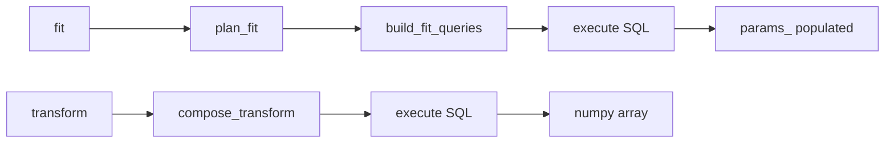

# Documentation — sqlearn

## Toolchain

| Tool | Purpose |
|---|---|
| mkdocs-material | Theme with search, tabs, dark mode, code copy, annotations |
| mkdocstrings[python] | Auto-generate API reference from Google-style docstrings |
| mkdocs-gen-files | Auto-generate API pages from source tree |
| mkdocs-literate-nav | Define nav from literate files |
| mkdocs-section-index | Clickable section headings |
| pymdownx.superfences | Mermaid diagrams, code blocks, admonitions |
| pymdownx.arithmatex | MathJax formulas for scaler/stat documentation |
| pymdownx.tabbed | Python/SQL side-by-side tabs |

## Commands

```bash
make docs          # mkdocs build (validate)
make docs-serve    # mkdocs serve (live preview at localhost:8000)
```

## Documentation Layers

| Layer | Audience | When to write |
|---|---|---|
| **API Reference** | Expert users looking up specifics | Auto-generated from docstrings. Ships with every new module. |
| **User Guide** | Users wanting to understand the system | M3: how compiler works, expression composition, column routing |
| **Tutorials** | New users getting started | M3: first pipeline, migrate from sklearn, custom transformers |
| **Transformers Gallery** | Users browsing by category | M4: runnable examples per transformer with SQL output |
| **Design Decisions** | Contributors, advanced users | M3: why each approach was chosen |

## Navigation Structure

sqlearn uses Material tabs for top-level sections:

```yaml
nav:
  - Home: index.md
  - Getting Started:
      - getting-started/index.md       # overview + install
      - First Pipeline: getting-started/first-pipeline.md
      - Custom Transformers: getting-started/custom-transformers.md
      - SQL Output: getting-started/sql-output.md
  - User Guide:
      - user-guide/index.md
      - How It Works: user-guide/how-it-works.md
      - Column Routing: user-guide/column-routing.md
      - Expression Composition: user-guide/expression-composition.md
      - Custom Transformers: user-guide/custom-transformers.md
  - Transformers:
      - transformers/index.md            # category browsing table
      - Scalers: transformers/scalers.md
      - Encoders: transformers/encoders.md
      - Imputers: transformers/imputers.md
  - API Reference:
      - api/index.md                     # master table of all public classes
      - Core: ...
      - Custom: ...
      - Transformers: ...
```

## Page Writing Rules

### Lead with SQL output

sqlearn's differentiator is SQL. Every example should show the generated SQL:

```markdown
## StandardScaler

Scales features to zero mean and unit variance.

=== "Python"

    ```python
    pipe = sq.Pipeline([sq.StandardScaler()])
    pipe.fit("train.parquet", y="target")
    X = pipe.transform("test.parquet")
    ```

=== "Generated SQL"

    ```sql
    SELECT
      (price - 42.5) / NULLIF(12.3, 0) AS price,
      (score - 78.2) / NULLIF(15.1, 0) AS score
    FROM test
    ```
```

### Cross-linking

Every API page should link to:
- The relevant User Guide section
- Related transformers
- The design decision explaining why

Use mkdocstrings autorefs — any `sqlearn.ClassName` in docstrings auto-links:

```python
"""See [Pipeline][sqlearn.core.pipeline.Pipeline] for orchestration."""
```

### Diagrams (Mermaid)

Use Material's built-in Mermaid support for architecture diagrams:

````markdown

````

### Math Formulas (MathJax)

Use for scaler/statistical documentation:

```markdown
StandardScaler computes: $z = \frac{x - \mu}{\sigma}$

Where $\mu$ is the population mean and $\sigma$ is the population standard deviation.
```

### Admonitions

```markdown
!!! tip "sklearn users"
    sqlearn's `StandardScaler` uses population std (ddof=0), matching sklearn's default.

!!! warning
    Pipelines are NOT thread-safe. Use `clone()` for concurrent access.

!!! note "SQL dialect"
    Generated SQL defaults to DuckDB. Pass `dialect="postgres"` for other targets.
```

## Docstring Standard

All docstrings follow Google style. Enforced by `interrogate` at 95%+ coverage.

Every public class/function docstring MUST include:

```python
def resolve_input(
    data: Any,
    backend: Backend,
    *,
    table_name: str | None = None,
) -> str:
    """Resolve user input to a queryable source name.

    Takes whatever the user passes to fit()/transform() and returns
    a source name string that the Backend can query.

    Args:
        data: Input data — file path (str), table name (str),
            or pandas DataFrame.
        backend: Backend instance for registering DataFrames.
        table_name: Override auto-generated name for DataFrames.

    Returns:
        Source name string usable by the backend.

    Raises:
        TypeError: If data type is not supported.

    Examples:
        >>> backend = DuckDBBackend()
        >>> resolve_input("train.parquet", backend)
        'train.parquet'
    """
```

**Required sections:** summary, Args, Returns, Raises, Examples (at least one).

## API Reference Pages

Each API page uses mkdocstrings to auto-generate from source:

```markdown
# StandardScaler

::: sqlearn.scalers.standard.StandardScaler
    options:
      show_source: true
      members_order: source
```

## Adding a New API Page

1. Create `docs/api/<name>.md` with the mkdocstrings directive above
2. Add to `nav:` in `mkdocs.yml` under the correct section
3. Run `make docs` to verify it builds

## Phased Rollout

| Phase | Milestone | What to ship |
|---|---|---|
| M2 (done) | v0.1.0 | mkdocs infrastructure + API reference for all core modules |
| M3 | v0.2.0 | User guide, tutorials, design decisions, more API pages |
| M4 | v0.3.0 | Transformers gallery with runnable examples |
| M7 | v1.0.0 | Full hosted site, versioned, migration guide, benchmarks |

## Glossary Terms

Define abbreviations that show hover tooltips across all pages:

```markdown
<!-- docs/includes/abbreviations.md -->
*[AST]: Abstract Syntax Tree
*[CTE]: Common Table Expression
*[OHE]: One-Hot Encoding
*[SQL]: Structured Query Language
*[DuckDB]: An in-process analytical database
```

Include in mkdocs.yml via `pymdownx.snippets` with `auto_append`.

## What NOT to Document

- Internal/private methods (single underscore prefix)
- Implementation details that change frequently — link to source
- Anything already in the architecture docs (`docs/01-14`)
- Third-party library internals (DuckDB, sqlglot) — link to their docs
